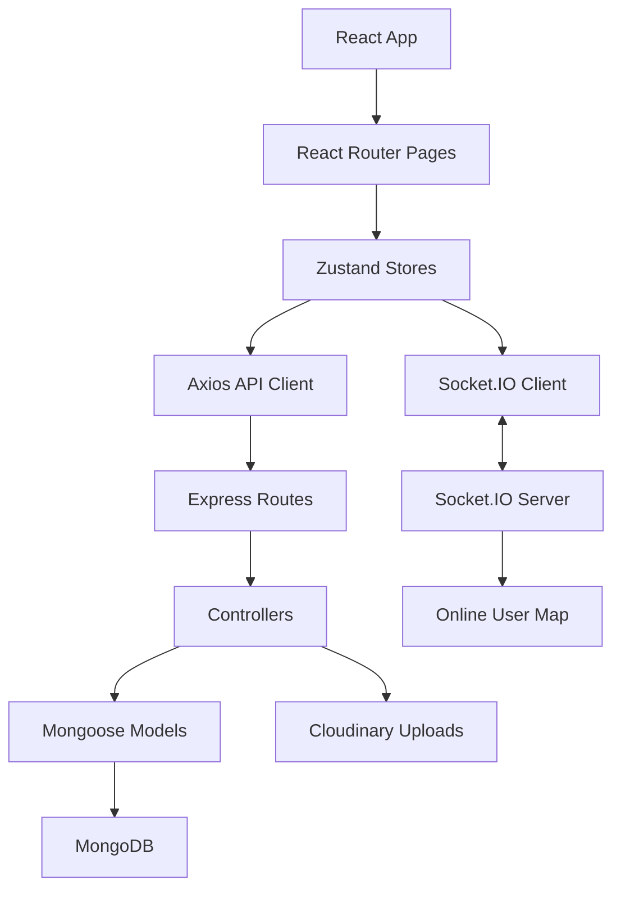
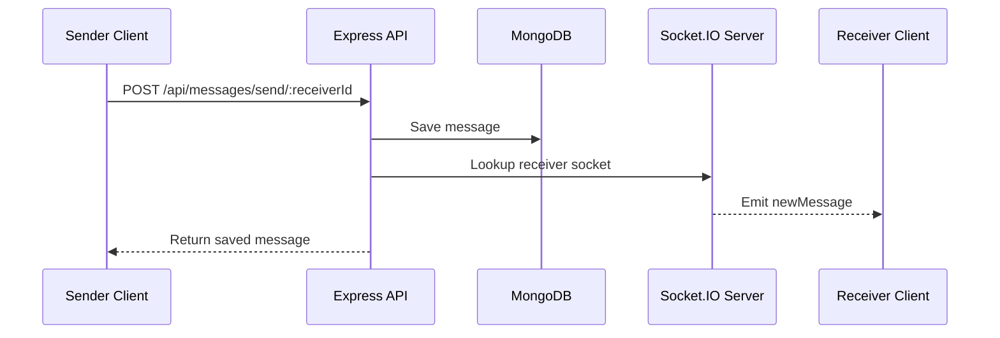

# Architecture Guide

This document outlines Yappy's application layers, state management, request flow, real-time messaging pipeline, and production serving model.

---

## 1. High-Level Flow

Yappy is a MERN-style chat application with a Vite React frontend, Express API backend, MongoDB persistence, Cloudinary media uploads, and Socket.IO real-time delivery.

---

## 2. Frontend Layers

### A. Routing (`frontend/src/App.jsx`)

`App.jsx` checks authentication on boot, applies the selected DaisyUI theme, renders the shared navbar, and protects routes with `Navigate`.

Primary routes:

- `/`: Authenticated chat workspace
- `/login`: Login page for anonymous users
- `/signup`: Account creation page for anonymous users
- `/profile`: Authenticated profile management
- `/settings`: Theme selection and preview

### B. State Stores (`frontend/src/store`)

- `useAuthStore`: Tracks auth user, login/signup/logout state, profile updates, online users, and Socket.IO connection lifecycle.
- `useChatStore`: Loads sidebar users, fetches conversation history, sends messages, and subscribes to incoming messages.
- `useThemeStore`: Persists and applies the active DaisyUI theme.

### C. UI Components (`frontend/src/components`)

- `Navbar`: Global Yappy brand shell and account navigation.
- `Sidebar`: Contact list with online-only filtering.
- `ChatContainer`: Conversation viewport and message rendering.
- `MessageInput`: Text/image message composer.
- `AuthImagePattern`: Branded authentication illustration panel.
- `NoChatSelected`: Empty chat landing state.

---

## 3. Backend Layers

### A. Server Entry (`backend/src/index.js`)

The backend configures middleware, registers API routes, serves the frontend build in production, starts the HTTP server, and connects to MongoDB.

### B. API Routes

- `POST /api/auth/signup`: Create user, hash password, set JWT cookie.
- `POST /api/auth/login`: Validate credentials and set JWT cookie.
- `POST /api/auth/logout`: Clear JWT cookie.
- `GET /api/auth/check`: Return the authenticated user.
- `PUT /api/auth/update-profile`: Upload profile image and update user.
- `GET /api/messages/users`: Return contacts excluding the current user.
- `GET /api/messages/:id`: Return one-to-one message history.
- `POST /api/messages/send/:id`: Persist and optionally deliver a new message.

### C. Models

- `User`: Stores full name, email, hashed password, profile image URL, and timestamps.
- `Message`: Stores sender, receiver, text, optional image URL, and timestamps.

---

## 4. Real-Time Messaging

The Socket.IO server keeps an in-memory `userSocketMap` of authenticated user IDs to active socket IDs.

Presence updates are broadcast with `getOnlineUsers` whenever users connect or disconnect.

---

## 5. Media Uploads

Profile images and message attachments are sent as base64 payloads from the frontend. The backend uploads them to Cloudinary and stores the resulting secure URL in MongoDB.

---

## 6. Configuration

Backend configuration lives in `backend/.env` and is documented in `backend/.env.example`.

Required values:

- `NODE_ENV`
- `PORT`
- `MONGODB_URI`
- `JWT_SECRET`
- `CLOUDINARY_CLOUD_NAME`
- `CLOUDINARY_API_KEY`
- `CLOUDINARY_API_SECRET`

---

## 7. Production Deployment

The root `npm run build` script installs dependencies and builds the Vite app. When `NODE_ENV=production`, Express serves `frontend/dist` and falls back to `index.html` for client-side routing.

---

## 8. Design Notes

The current UI rebrand introduces:

- A Yappy brand mark using `MessageCircleHeart`.
- Gradient brand text and glass-style layout cards.
- A brighter auth experience with animated pattern tiles.
- Softer chat backgrounds, themed active states, and a branded empty state.
